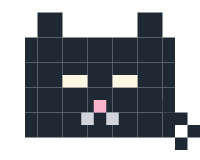

  

  Calm, creative Flutter / Mobile developer building cozy, reliable mobile experiences.

  <a href="mailto:adilkananarbekov751@gmail.com">Email</a> |
  <a href="https://www.linkedin.com/in/AdilkanAnarbekov">LinkedIn</a> |
  <a href="https://t.me/Adilkan_07">Telegram</a>

  

## About
- Flutter and Dart focused, mobile-first development
- Practical hardware integration (Arduino + Bluetooth)
- Calm, detail-driven engineering with clean structure
- Open to internships and junior roles

## Tech stack

  
  
  
  
  
  
  
  <picture>
    <source media="(prefers-color-scheme: dark)" srcset="https://github.githubassets.com/images/modules/logos_page/GitHub-Mark-Light-64px.png">
    
  </picture>

## Projects
### Smart Light Control
Flutter app + Arduino (HC-05) to toggle lighting with reliable Bluetooth pairing.
- Highlights: device connection flow, simple permissions, clean UI structure
- Status: demo available on request

### Kyrgyz-English Learning App
Flutter + Firebase learning app with authentication and word practice.
- Repo: https://github.com/adilkananarbekov/learn_kyrgyz

  
Stats snapshot

  - 3rd year CS student
  - 2+ years of C++ and competitive programming
  - Hands-on mobile and hardware integration projects
  - Daily tools: Flutter, Dart, Git, GitHub

  

  

  Built for calm, reliable mobile experiences.

