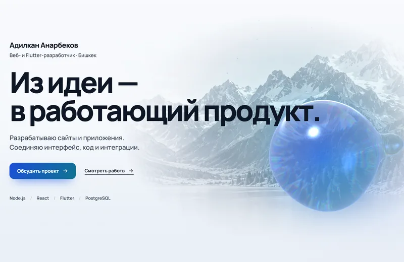
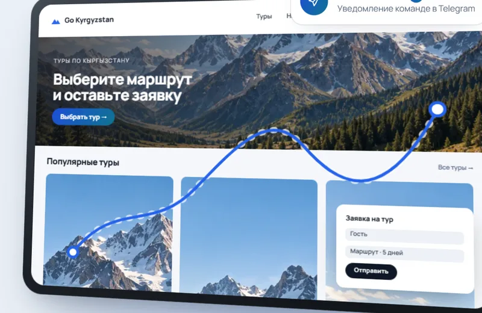
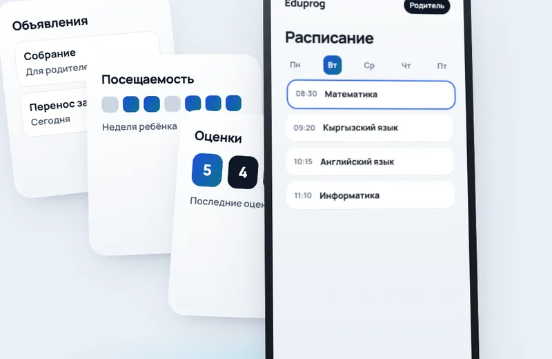
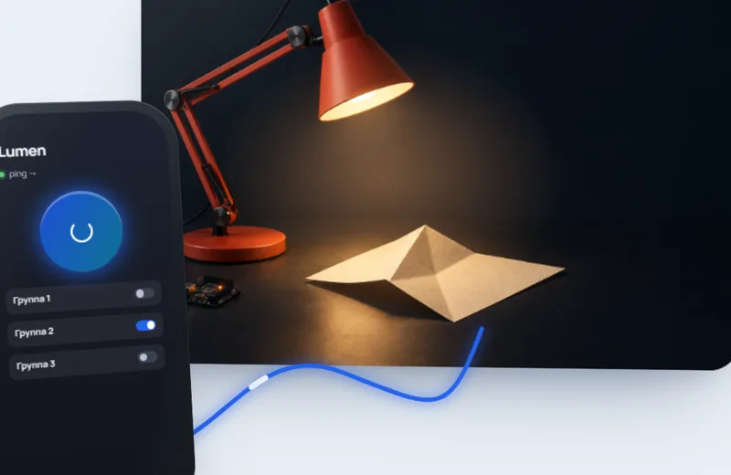
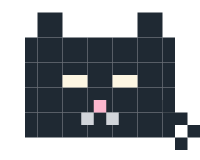

<a href="https://adilkan.com">
  <picture>
    <source media="(prefers-color-scheme: dark)" srcset="assets/banner-dark.svg">
    
  </picture>
</a>

  I build websites and apps: a clear interface, the code behind it 
  and the integrations that make it work — with attention to how the product looks and feels.

  
  
  
  

<picture>
  <source media="(prefers-color-scheme: dark)" srcset="assets/divider-dark.svg">
  
</picture>

## What I do

<table>
  <tr>
    <td width="50%" valign="top"><b>Web interfaces</b> React and TypeScript: fast, clear pages with their own character.</td>
    <td width="50%" valign="top"><b>Apps</b> Flutter and Dart: from the first screen to working flows with real data.</td>
  </tr>
  <tr>
    <td width="50%" valign="top"><b>Server side</b> Node.js and PostgreSQL: APIs, integrations and Telegram automation.</td>
    <td width="50%" valign="top"><b>Interactive graphics</b> Hand-written WebGL, 3D scenes and motion, plus Arduino hardware over Bluetooth.</td>
  </tr>
</table>

## Featured work

<table>
  <tr>
    <td width="50%" valign="top">
      <a href="https://adilkan.com">
        <picture>
          <source media="(prefers-color-scheme: dark)" srcset="assets/projects/adilkan-dark.webp">
          
        </picture>
      </a>
      <h3><a href="https://adilkan.com">adilkan.com</a></h3>
      My portfolio, told as a story: a WebGL droplet travels through the projects,
      <a href="https://adilkan.com/desk">/desk</a> is a 3D workshop, and ADI-01, a small companion,
      guides visitors around the page and answers their questions.  
      <code>JavaScript</code> <code>WebGL</code> <code>Node.js</code>  
      🌐 <a href="https://adilkan.com">Live site</a> · 🔒 private source
    </td>
    <td width="50%" valign="top">
      <a href="https://kyrgyz.tours">
        <picture>
          <source media="(prefers-color-scheme: dark)" srcset="assets/projects/go-kyrgyzstan-dark.webp">
          
        </picture>
      </a>
      <h3><a href="https://kyrgyz.tours">Go Kyrgyzstan Travel</a></h3>
      Tour sales for Kyrgyzstan: a tour catalog, day-by-day programs, booking requests,
      an admin panel and Telegram notifications for every new request.  
      <code>React</code> <code>TypeScript</code> <code>Express</code> <code>SQLite</code>  
      🌐 <a href="https://kyrgyz.tours">kyrgyz.tours</a> · 📦 <a href="https://github.com/adilkananarbekov/Tourism">code</a>
    </td>
  </tr>
  <tr>
    <td width="50%" valign="top">
      <a href="https://github.com/adilkananarbekov/eduprog_firebase">
        <picture>
          <source media="(prefers-color-scheme: dark)" srcset="assets/projects/eduprog-dark.webp">
          
        </picture>
      </a>
      <h3><a href="https://github.com/adilkananarbekov/eduprog_firebase">Eduprog</a></h3>
      A Flutter app for running classes: schedule, grades, attendance
      and announcements in one place. In development.  
      <code>Flutter</code> <code>Dart</code> <code>Riverpod</code> <code>GoRouter</code>  
      📦 <a href="https://github.com/adilkananarbekov/eduprog_firebase">code</a>
    </td>
    <td width="50%" valign="top">
      <a href="https://github.com/adilkananarbekov/Control_light">
        <picture>
          <source media="(prefers-color-scheme: dark)" srcset="assets/projects/lumen-dark.webp">
          
        </picture>
      </a>
      <h3><a href="https://github.com/adilkananarbekov/Control_light">Lumen Control</a></h3>
      A tap in the app, light in the room: a Flutter app that switches Arduino-driven
      light groups over Bluetooth. A hardware prototype.  
      <code>Flutter</code> <code>Arduino</code> <code>Bluetooth</code>  
      📦 <a href="https://github.com/adilkananarbekov/Control_light">code</a>
    </td>
  </tr>
</table>

**More experiments:**
[mine-sweeper](https://github.com/adilkananarbekov/mine-sweeper) — Minesweeper in vanilla JavaScript ([play](https://adilkananarbekov.github.io/mine-sweeper/)) ·
[Nvidia_presentaion_webpage](https://github.com/adilkananarbekov/Nvidia_presentaion_webpage) — a scroll-driven presentation with Three.js and GSAP ([open](https://adilkananarbekov.github.io/Nvidia_presentaion_webpage/)) ·
[Orozo-ait](https://github.com/adilkananarbekov/Orozo-ait) — a holiday greeting with a Three.js moon ([open](https://adilkananarbekov.github.io/Orozo-ait/))

**Client work:** e-commerce stores, booking sites and admin panels. Details on request.

## Stack

<b>CORE</b> 
  <a href="https://adilkan.com">
    <picture>
      <source media="(prefers-color-scheme: dark)" srcset="https://skillicons.dev/icons?i=nodejs%2Creact%2Cflutter%2Cpostgres&theme=dark">
      
    </picture>
  </a>

<b>ALSO</b> 
  <picture>
    <source media="(prefers-color-scheme: dark)" srcset="https://skillicons.dev/icons?i=ts%2Cjs%2Cdart%2Cexpress%2Csqlite%2Chtml%2Ccss%2Cthreejs%2Carduino%2Cnginx%2Clinux%2Cgit&perline=12&theme=dark">
    
  </picture>

## On GitHub

  <picture>
    <source media="(prefers-color-scheme: dark)" srcset="https://github-profile-summary-cards.vercel.app/api/cards/stats?username=adilkananarbekov&theme=github_dark">
    
  </picture>
  <picture>
    <source media="(prefers-color-scheme: dark)" srcset="https://github-profile-summary-cards.vercel.app/api/cards/repos-per-language?username=adilkananarbekov&theme=github_dark">
    
  </picture>

<picture>
  <source media="(prefers-color-scheme: dark)" srcset="assets/divider-dark.svg">
  
</picture>

  

  <b>Have a site or an app in mind?</b> 
  Write to me on <a href="https://t.me/Adilkan_07">Telegram</a> or at
  <a href="mailto:adilkananarbekov751@gmail.com">adilkananarbekov751@gmail.com</a> — and let's turn the idea into a working product.

  

