<a href="https://adilkan.com">
  <picture>
    <source media="(prefers-color-scheme: dark)" srcset="assets/lab/hero-dark.svg">
    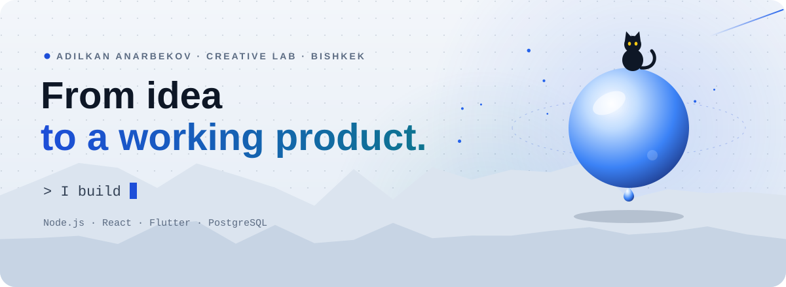
  </picture>
</a>

  <a href="https://adilkan.com" title="Portfolio told as a story, with a 3D workshop (in Russian)"><picture><source media="(prefers-color-scheme: dark)" srcset="assets/lab/btn-site-dark.svg"></picture></a>
  <a href="https://t.me/Adilkan_07" title="Telegram: @Adilkan_07"><picture><source media="(prefers-color-scheme: dark)" srcset="assets/lab/btn-telegram-dark.svg">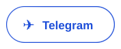</picture></a>
  <a href="mailto:adilkananarbekov751@gmail.com" title="adilkananarbekov751@gmail.com"><picture><source media="(prefers-color-scheme: dark)" srcset="assets/lab/btn-email-dark.svg"></picture></a>
  <a href="https://www.linkedin.com/in/адилкан-анарбеков-5b157b303" title="LinkedIn"><picture><source media="(prefers-color-scheme: dark)" srcset="assets/lab/btn-linkedin-dark.svg"></picture></a>

  <b>Web &amp; Flutter developer with commercial experience.</b> 
  I build websites and apps — a clear interface, the code behind it and the integrations that make it work.

<picture><source media="(prefers-color-scheme: dark)" srcset="assets/lab/divider-dark.svg"></picture>

<picture><source media="(prefers-color-scheme: dark)" srcset="assets/lab/h01-dark.svg">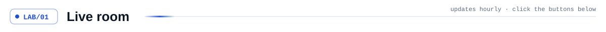</picture>

<a href="https://github.com/adilkananarbekov/adilkananarbekov/issues/new?title=lab%3A%20switch%20the%20lamp&body=Just%20press%20%22Create%22%20%E2%80%94%20the%20lab%20bot%20switches%20the%20lamp%20in%20the%20live%20room%20for%20everyone%20and%20closes%20this%20issue.%20%F0%9F%92%A1" title="Click the room to switch the lamp — for everyone who opens this page">
  <picture>
    <source media="(prefers-color-scheme: dark)" srcset="https://raw.githubusercontent.com/adilkananarbekov/adilkananarbekov/lab-output/live-dark.svg">
    
  </picture>
</a>

  <a href="https://github.com/adilkananarbekov/adilkananarbekov/issues/new?title=lab%3A%20switch%20the%20lamp&body=Just%20press%20%22Create%22%20%E2%80%94%20the%20lab%20bot%20switches%20the%20lamp%20in%20the%20live%20room%20for%20everyone%20and%20closes%20this%20issue.%20%F0%9F%92%A1" title="Opens a pre-filled issue: press Create and the lamp switches for everyone"><picture><source media="(prefers-color-scheme: dark)" srcset="assets/lab/btn-lamp-dark.svg">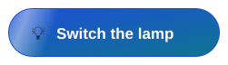</picture></a>
  <a href="https://github.com/adilkananarbekov/adilkananarbekov/issues/new?title=lab%3A%20feed%20the%20cat&body=Just%20press%20%22Create%22%20%E2%80%94%20the%20lab%20bot%20feeds%20the%20cat%2C%20remembers%20you%20and%20closes%20this%20issue.%20%F0%9F%90%9F" title="Opens a pre-filled issue: press Create and the cat gets its fish"><picture><source media="(prefers-color-scheme: dark)" srcset="assets/lab/btn-cat-dark.svg">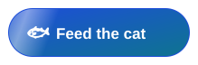</picture></a>

<b>How does the live room work?</b>

 

- The window follows the real sunrise and sunset in Bishkek: the sun moves along its arc during the day, the moon and the stars come out at night. The clock on the wall shows the time of the last redraw.
- **Switch the lamp** and **Feed the cat** open a pre-filled issue. Press *Create*, and a GitHub Action ([`lab.yml`](.github/workflows/lab.yml)) switches the lamp or feeds the cat, thanks you in a comment and closes the issue. The picture changes for every visitor within about five minutes (GitHub caches images).
- The lamp is a nod to [Lumen Control](https://github.com/adilkananarbekov/Control_light): a tap in the app — light in the room.
- The cat sleeps at night when the lamp is off and gets hungry if nobody feeds it for a day.
- Everything is plain SVG drawn by the [`lab/`](lab) scripts — no third-party services, no trackers. The room is redrawn every hour into the [`lab-output`](https://github.com/adilkananarbekov/adilkananarbekov/tree/lab-output) branch.

<picture><source media="(prefers-color-scheme: dark)" srcset="assets/lab/h02-dark.svg">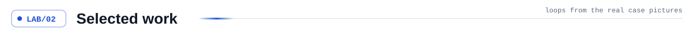</picture>

<table>
  <tr>
    <td width="50%" valign="top">
      <a href="https://adilkan.com" title="Open adilkan.com"><picture><source media="(prefers-color-scheme: dark)" srcset="assets/lab/card-adilkan-dark.svg">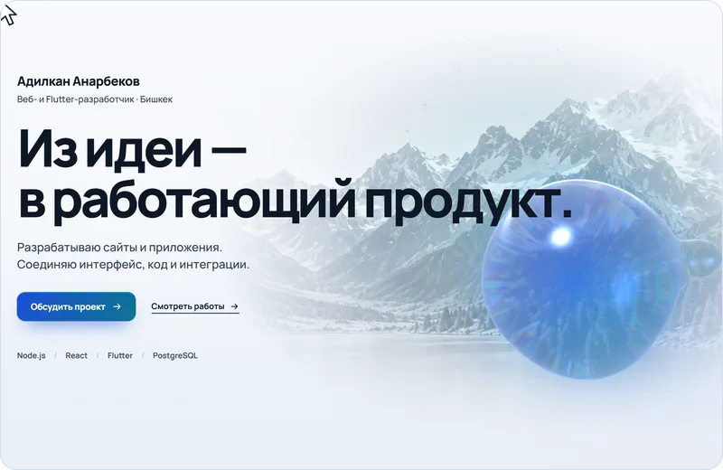</picture></a>
      <h3><a href="https://adilkan.com">adilkan.com</a></h3>
      My portfolio, told as a story: a WebGL droplet travels through the projects,
      <a href="https://adilkan.com/desk">/desk</a> is a 3D workshop, and ADI-01, a small companion,
      guides visitors around the page and answers their questions.  
      <code>JavaScript</code> <code>WebGL</code> <code>Node.js</code>  
      🌐 <a href="https://adilkan.com">live site</a> (in Russian) · 🔒 private source
    </td>
    <td width="50%" valign="top">
      <a href="https://kyrgyz.tours" title="Open kyrgyz.tours"><picture><source media="(prefers-color-scheme: dark)" srcset="assets/lab/card-go-kyrgyzstan-dark.svg">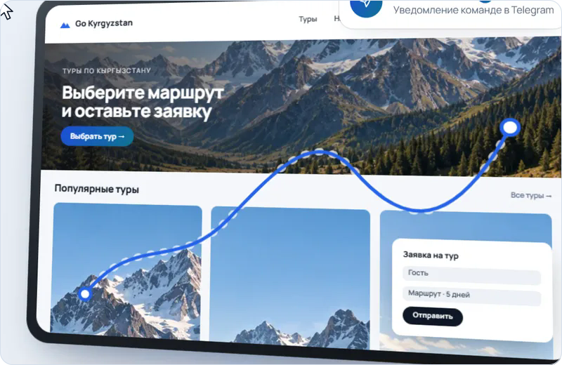</picture></a>
      <h3><a href="https://kyrgyz.tours">Go Kyrgyzstan Travel</a></h3>
      Tour sales for Kyrgyzstan: a tour catalog, day-by-day programs, booking requests,
      an admin panel and Telegram notifications for every new request.  
      <code>React</code> <code>TypeScript</code> <code>Express</code> <code>SQLite</code>  
      🌐 <a href="https://kyrgyz.tours">kyrgyz.tours</a> · 📦 <a href="https://github.com/adilkananarbekov/Tourism">code</a>
    </td>
  </tr>
</table>
<table>
  <tr>
    <td width="50%" valign="top">
      <a href="https://github.com/adilkananarbekov/eduprog_firebase" title="Open the Eduprog repository"><picture><source media="(prefers-color-scheme: dark)" srcset="assets/lab/card-eduprog-dark.svg">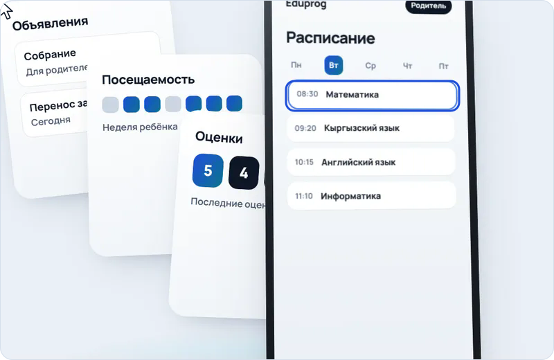</picture></a>
      <h3><a href="https://github.com/adilkananarbekov/eduprog_firebase">Eduprog</a></h3>
      A Flutter app for running classes: schedule, grades, attendance
      and announcements in one place. In development.  
      <code>Flutter</code> <code>Dart</code> <code>Riverpod</code> <code>GoRouter</code>  
      📦 <a href="https://github.com/adilkananarbekov/eduprog_firebase">code</a>
    </td>
    <td width="50%" valign="top">
      <a href="https://github.com/adilkananarbekov/Control_light" title="Open the Lumen Control repository"><picture><source media="(prefers-color-scheme: dark)" srcset="assets/lab/card-lumen-dark.svg">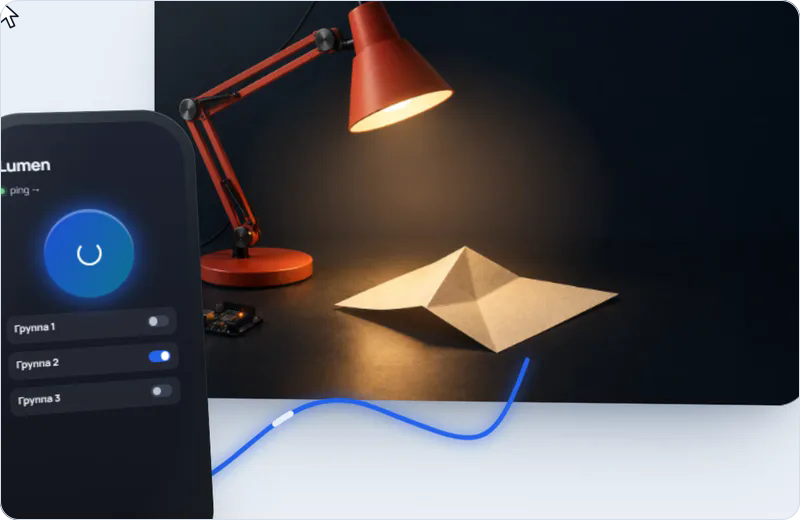</picture></a>
      <h3><a href="https://github.com/adilkananarbekov/Control_light">Lumen Control</a></h3>
      A tap in the app, light in the room: a Flutter app that switches Arduino-driven
      light groups over Bluetooth. A hardware prototype.  
      <code>Flutter</code> <code>Arduino</code> <code>Bluetooth</code>  
      📦 <a href="https://github.com/adilkananarbekov/Control_light">code</a>
    </td>
  </tr>
</table>

**More experiments:**
[mine-sweeper](https://github.com/adilkananarbekov/mine-sweeper) — Minesweeper in vanilla JavaScript ([play](https://adilkananarbekov.github.io/mine-sweeper/)) ·
[NVIDIA presentation](https://github.com/adilkananarbekov/Nvidia_presentaion_webpage) — a scroll-driven presentation with Three.js and GSAP ([open](https://adilkananarbekov.github.io/Nvidia_presentaion_webpage/)) ·
[Orozo-ait](https://github.com/adilkananarbekov/Orozo-ait) — a holiday greeting with a Three.js moon ([open](https://adilkananarbekov.github.io/Orozo-ait/))

<picture><source media="(prefers-color-scheme: dark)" srcset="assets/lab/h03-dark.svg">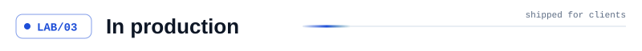</picture>

Sites and systems I have built and shipped for clients in Kyrgyzstan and the United States:

- **E-commerce** — online stores with Stripe checkout, subscriptions, inventory, order fulfillment and an owner admin panel.
- **Booking and tourism** — tour catalogs, booking requests, availability calendars, multilingual SEO pages and Telegram lead delivery.
- **Education platforms** — online courses, schedules, grades and attendance, admin tools for schools.
- **Migrations and accessibility** — moving a live site off WordPress to its own stack, WCAG 2.2 AA fixes.
- **Delivery** — Linux VPS, Nginx, systemd, atomic releases with rollback, backups.

Client projects are shown on request.

<picture><source media="(prefers-color-scheme: dark)" srcset="assets/lab/h04-dark.svg">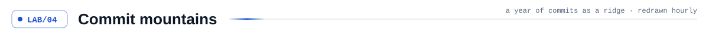</picture>

<picture>
  <source media="(prefers-color-scheme: dark)" srcset="https://raw.githubusercontent.com/adilkananarbekov/adilkananarbekov/lab-output/mountains-dark.svg">
  
</picture>

<picture><source media="(prefers-color-scheme: dark)" srcset="assets/lab/h05-dark.svg">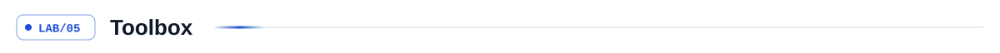</picture>

<b>CORE</b> 
  <picture>
    <source media="(prefers-color-scheme: dark)" srcset="https://skillicons.dev/icons?i=nodejs%2Creact%2Cflutter%2Cpostgres&theme=dark">
    
  </picture>

<b>ALSO</b> 
  <picture>
    <source media="(prefers-color-scheme: dark)" srcset="https://skillicons.dev/icons?i=ts%2Cjs%2Cdart%2Cexpress%2Csqlite%2Chtml%2Ccss%2Cthreejs%2Carduino%2Cnginx%2Clinux%2Cgit&perline=12&theme=dark">
    
  </picture>

<b>Open the ADI-01 terminal</b>

 
<picture><source media="(prefers-color-scheme: dark)" srcset="assets/lab/terminal-dark.svg">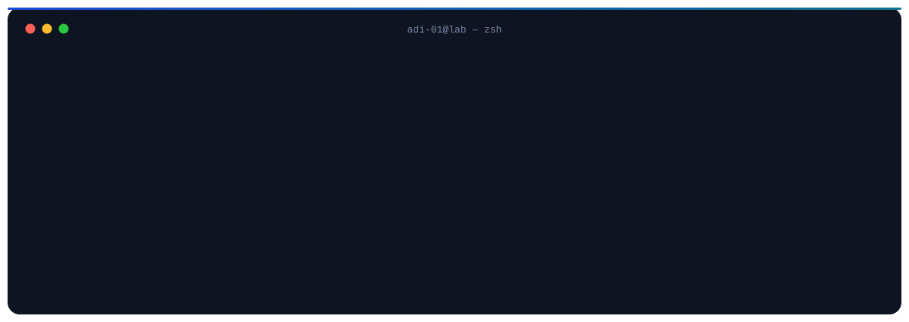</picture>

<picture><source media="(prefers-color-scheme: dark)" srcset="assets/lab/divider-dark.svg"></picture>

  

  <b>Have a site or an app in mind?</b> 
  Write to me on <a href="https://t.me/Adilkan_07">Telegram</a> or at
  <a href="mailto:adilkananarbekov751@gmail.com">adilkananarbekov751@gmail.com</a> — and let's turn the idea into a working product.

