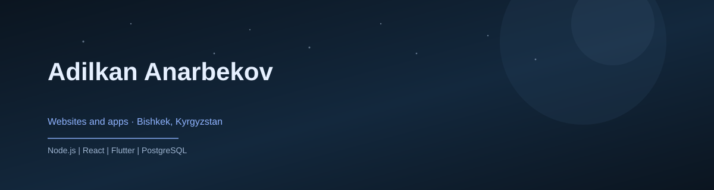
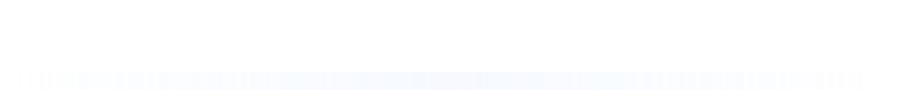

  

<h3 align="center">Web &amp; Flutter developer &middot; interfaces and integrations &middot; Bishkek, Kyrgyzstan</h3>

  I build websites and apps: a clear interface, the code behind it and the integrations that make it work,
  with attention to how the product looks and feels. &#x1F43E;

  
  
  
  

  

  

## &#x2744;&#xFE0F; What I do
- Web interfaces in React and TypeScript
- Flutter / Dart apps
- Server side on Node.js and PostgreSQL: APIs and Telegram automation
- Interactive graphics and visual prototypes, down to hand-written WebGL
- Hardware side projects: Arduino over Bluetooth

  

## &#x1F9F0; Tech stack

CORE

  &nbsp;
  &nbsp;
  &nbsp;
  

ALSO

  
  
  <picture>
    <source media="(prefers-color-scheme: dark)" srcset="https://cdn.simpleicons.org/express/ffffff" />
    
  </picture>
  
  
  <picture>
    <source media="(prefers-color-scheme: dark)" srcset="https://cdn.simpleicons.org/webgl/ffffff" />
    
  </picture>
  
  
  
  

  

## &#x1F680; Featured projects

### [adilkan.com](https://adilkan.com)
My portfolio site, told as a story: *from idea to a working product*. The home page has a native WebGL droplet,
[/desk](https://adilkan.com/desk) is a full-screen 3D workshop, and ADI-01, a small companion, flies around the site
and answers visitors' questions. The front end is vanilla JavaScript; the server side is plain Node.js with zero runtime dependencies. 
`JavaScript` `WebGL` `HTML/CSS` `Node.js` 
&#x1F310; [adilkan.com](https://adilkan.com) &middot; &#x1F512; the source code is in a private repository

### [Go Kyrgyzstan Travel](https://kyrgyz.tours)
Tour-sales website for Kyrgyzstan: tour catalog, day-by-day programs, booking requests, an admin panel,
and Telegram notifications for new requests. 
`React` `TypeScript` `Express` `SQLite` `Telegram Bot API` 
&#x1F310; [kyrgyz.tours](https://kyrgyz.tours) &middot; &#x1F4E6; [repository](https://github.com/adilkananarbekov/Tourism)

### [Eduprog](https://github.com/adilkananarbekov/eduprog_firebase)
Flutter app for running classes: roles, schedule, grades, attendance and announcements. In development. 
`Flutter` `Dart` `Riverpod` `GoRouter` 
&#x1F4E6; [repository](https://github.com/adilkananarbekov/eduprog_firebase)

### [Lumen Control](https://github.com/adilkananarbekov/Control_light)
Flutter app that switches Arduino-driven light groups over Bluetooth. A hardware prototype: the Arduino sketch
handles the LED groups, incoming commands and a ping/pong connection check. 
`Flutter` `Dart` `Arduino` `Bluetooth` 
&#x1F4E6; [repository](https://github.com/adilkananarbekov/Control_light)

### More experiments
[mine-sweeper](https://github.com/adilkananarbekov/mine-sweeper), Minesweeper in vanilla JavaScript ([play](https://adilkananarbekov.github.io/mine-sweeper/))
&middot; [Nvidia_presentaion_webpage](https://github.com/adilkananarbekov/Nvidia_presentaion_webpage), a scroll-driven presentation with Three.js and GSAP ([open](https://adilkananarbekov.github.io/Nvidia_presentaion_webpage/))
&middot; [Orozo-ait](https://github.com/adilkananarbekov/Orozo-ait), a greeting site with Three.js and GSAP ([open](https://adilkananarbekov.github.io/Orozo-ait/))

**Client work:** e-commerce stores, booking sites and admin panels for clients. Details on request.

  

## &#x1F4CA; GitHub stats

  
  

  

  

  

  

  Cat-approved builds and debugging. &#x1F60E;

  

  Have a site or an app in mind? Write to me on <a href="https://t.me/Adilkan_07">Telegram</a>
  or at <a href="mailto:adilkananarbekov751@gmail.com">adilkananarbekov751@gmail.com</a>. &#x2728;

